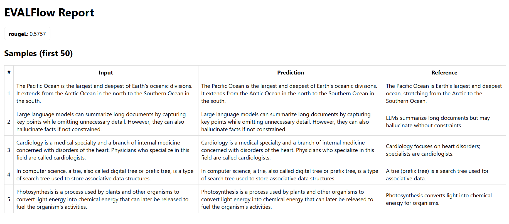

# EVALFlow


A lightweight, reproducible evaluation pipeline for LLMs with golden datasets and regression/drift monitoring.

---

## 📑 Table of Contents
- [Features](#features)
- [Quickstart](#quickstart)
- [Example Output](#-example-output)
- [Config Schema](#config-schema-example)
- [Extend](#extend)
- [Tests](#tests)
- [Roadmap](#roadmap)

---

## ✨ Features

- 📂 **Config-driven**: run tasks via YAML configs (`configs/`)
- 🧪 **Reproducible**: deterministic seeds & consistent results
- 📊 **Regression Monitoring**: compare runs against baselines
- 🔌 **Plug-in Metrics**: ROUGE-L, Accuracy, BLEU (extensible via registry)
- 🤖 **Providers**:  
  - `DummyProvider` (offline demo)  
  - `OpenAIProvider` (`pip install -e .[openai]`, requires `OPENAI_API_KEY`)  
- 📰 **Reporters**: HTML + Markdown reports (auto-generated)
- ✅ **CI Ready**: tested via GitHub Actions (`pytest`)

---

## 🚀 Quickstart

### 1. Install

```bash
git clone https://github.com/jojojoy/EVALFlow.git
cd EVALFlow
python -m venv .venv
source .venv/bin/activate   # Windows: .venv\Scripts\Activate.ps1
pip install -e .[dev]
```

### Report Screenshot

 
